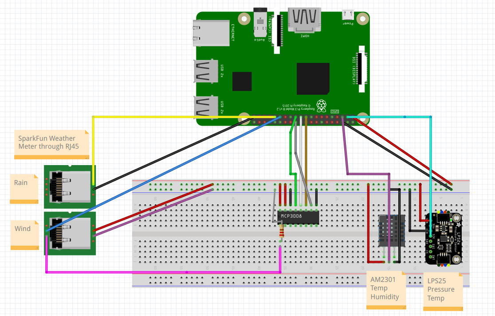

# Pistacja
## A web-based weather station built with Raspberry Pi and Python.

    

🇵🇱 Wersja po polsku jest dostepna [tutaj](../master/README_pl.md).

*The name is a wordplay in Polish - Pi because it's built with Raspberry Pi and stacja (station). Together they make pistachio.*

### Features
* Current weather conditions (temperature, wind speed anddirection, humidity, pressure, etc.)
* History of the weather at given dates
* Statistical data - charts and graphs for the weather this week and this month
* Server info: Neofetch, uptime

Loosely based on [this guide](https://projects.raspberrypi.org/en/projects/build-your-own-weather-station/0), however due to hardware differences I wrote a lot of the code myself.

### Requirements
* Raspberry Pi (tested on Model 3 B V1.2). Internet connection required.
* Latest version of Raspbian with Python 3.7+ installed
* MCP3008 ADC converter
* Two Ethernet outlets or breakout boards
* Barometer and altimeter (built with Pololu LPS25H)
* Anemometer, rain gauge (built with SparkFun Weather Meter Kit)
* Temperature and humidity sensor (built with Aosong AM2301)
* 4.7kΩ resistor

### Installation
1. Build the weather station according to this schema:
[TBD]
2. Clone this repository to your Raspberry Pi
3. Enable I2C and SPI in `raspi-config`. Reboot.
4. Install the required Python packages: `pip3 install -r requirements.txt`
5. Set the database config in .db to point to an external server
6. Run the server: `python3 main.py`
7. Paste the frontend directory to your web server's root directory and set db_connect.php to point to the same server
8. Open the website in your browser and enjoy!

### Build schematic

### Screenshots
## Backend
[TBD]
## Frontend
[TBD]

### License and Credits
This project is licensed under the GPLv3 license - see the LICENSE.md file for details.
Thanks to the Raspberry Pi Foundation for the guide.
Schematics made in Fritzing.

Made by Jakub Rutkowski (x5px) 2023