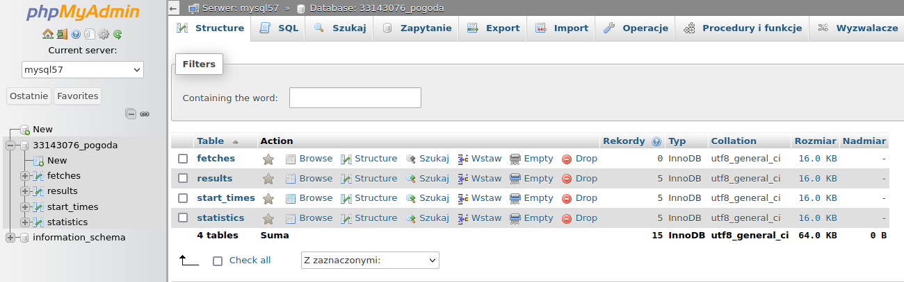
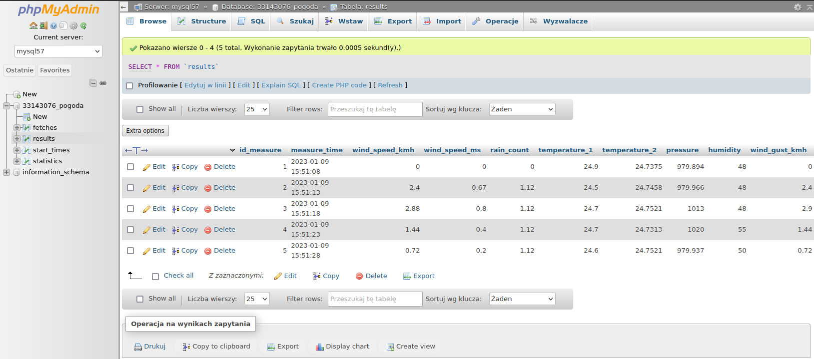
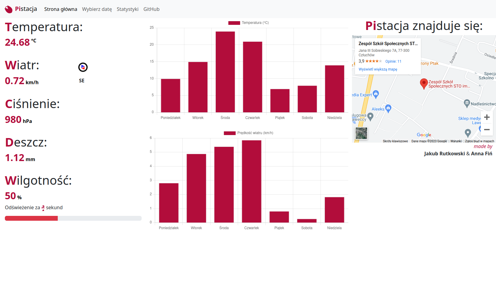

# Pistacja
## Internetowa stacja pogodowa zbudowana przy użyciu Raspberry Pi i Pythona.

    

## Funkcje
* Aktualne warunki pogodowe (temperatura, prędkość i kierunek wiatru, wilgotność, ciśnienie itp.)
* Historia pogody w wybranych datach
* Dane statystyczne - wykresy i diagramy dla pogody w tym tygodniu i miesiącu
* Informacje o serwerze: Neofetch, uptime

Luźno oparte na [tej instrukcji](https://projects.raspberrypi.org/en/projects/build-your-own-weather-station/0), jednak ze względu na różnice sprzętowe, większość kodu napisałem sam.

## Wymagania
* Raspberry Pi (testowane na Model 3 B V1.2). Wymagane połączenie z Internetem.
* Najnowsza wersja systemu Raspbian z zainstalowanym Pythonem 3.7+.
* Konwerter ADC MCP3008
* Dwa gniazda Ethernet lub płytki typu breakout
* Barometr i wysokościomierz (w projekcie użyty Pololu LPS25H)
* Anemometr, miernik deszczu (w projekcie użyty SparkFun Weather Meter Kit)
* Czujnik temperatury i wilgotności (w projekcie użyty Aosong AM2301)
* Opornik 4,7kΩ

## Instalacja
1. Zbuduj stację pogodową zgodnie ze schematem w opisie.
2. Sklonuj to repozytorium na swoje Raspberry Pi
3. Wejdź w konfigurację `raspi-config` i włącz I2C i SPI. Zrestartuj Raspberry Pi.
4. Zainstaluj wymagane pakiety Pythona: `pip3 install -r requirements.txt`
5. Ustaw konfigurację bazy danych w .db, aby wskazywała na zewnętrzny serwer
6. Uruchom serwer: `python3 main.py`
7. Wklej katalog frontend do katalogu głównego serwera WWW i ustaw db_connect.php tak, aby wskazywał na ten sam serwer.
8. Otwórz stronę w przeglądarce i gotowe!

## Schemat

## Zrzuty ekranu

### Wykonanie
[TBD]

### Backend

### Frontend

## Licencja
Ten projekt jest objęty licencją GPLv3 - szczegóły w pliku LICENSE.md.
Podziękowania dla fundacji Raspberry Pi za stworzenie poradnika.
Schematy wykonane w aplikacji Fritzing.

Autor: Jakub Rutkowski (x5px) 2023
